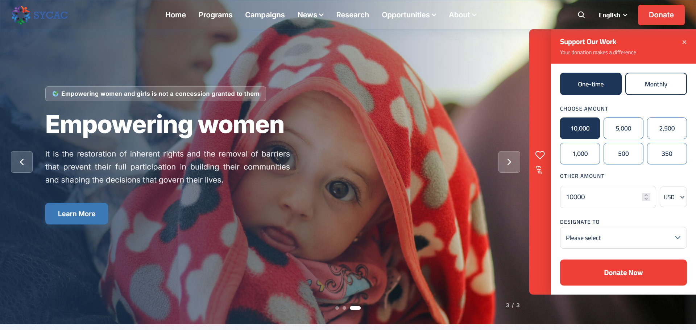
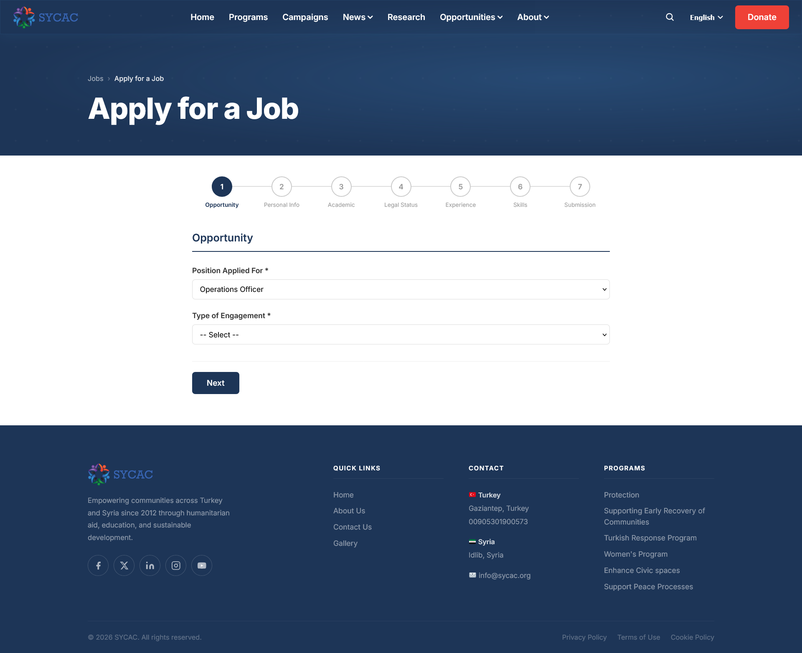
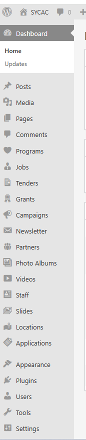
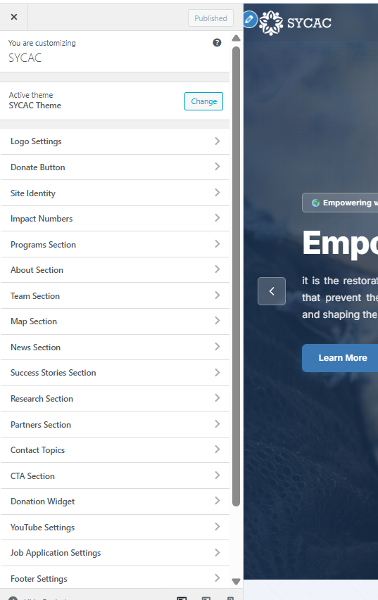

# SYCAC — Syrian Civil Administration Center

**Official Website Project**

**Website:** [https://sycac.org](https://sycac.org)

---

## About the Organization | عن المنظمة

**SYCAC (Syrian Civil Administration Center)** is an NGO dedicated to supporting civil society, governance, and humanitarian initiatives in Syria and the surrounding region.

**SYCAC (المركز السوري للإدارة المدنية)** منظمة غير حكومية تُعنى بدعم المجتمع المدني والحوكمة والمبادرات الإنسانية في سوريا والمنطقة المحيطة بها.

---

## Project Overview | نظرة عامة على المشروع

This repository documents the development of the SYCAC public-facing website — a fully custom WordPress implementation built from scratch without any page builder or third-party theme dependency.

يوثّق هذا المستودع تطوير الموقع الإلكتروني الرسمي لـ SYCAC — وهو تطبيق WordPress مخصص بالكامل، مبني من الصفر دون الاعتماد على أي صفحة بناء أو ثيم جاهز.

---

## Screenshots | لقطات الشاشة

### Homepage — English

### Homepage — Arabic (RTL)

### Homepage — Turkish

### Donation Widget

### Job Application Form (7-Step)

### WordPress Admin — Custom Post Types

### WordPress Admin — Customizer Sections

---

## Key Features | الميزات الرئيسية

### Multilingual Support | دعم تعدد اللغات

Full support for **English**, **Arabic (RTL)**, and **Turkish** via a custom multilingual routing system built without any plugins. Language-aware URLs, RTL layout switching, and per-language content fields are all handled in custom PHP.

### Content Management | إدارة المحتوى

- **11 Custom Post Types:** Campaigns, Programs, Jobs, Tenders, Grants, Staff, Partners, Albums, Videos, Slides, and Locations
- **100+ WordPress Customizer Settings** — every section, label, URL, and toggle is manageable from the Admin panel with no hardcoded values
- Fully translatable content stored as post meta fields per language

### Donation System | نظام التبرعات

Integrated **GlobalGiving API** for live campaign fundraising with a multilingual donation widget, one-time and monthly giving options, currency selection, and per-campaign designation. Campaign stats are cached to minimize API calls.

### Job Application System | نظام طلبات التوظيف

A fully custom **7-step AJAX job application form** covering opportunity selection, personal info, academic background, legal status, work experience, skills, and final submission — built entirely without plugins.

### Newsletter System | نظام النشرة البريدية

**Brevo (Sendinblue) API** integration with reCAPTCHA v2 protection, subscriber list management, and an admin-side newsletter generator for composing and dispatching email campaigns.

### Media & Gallery | الوسائط والمعرض

Photo albums with **GLightbox** lightbox integration, YouTube channel API integration for video galleries, and a dedicated gallery page combining both media types.

### Staff Management | إدارة الموظفين

Staff profiles with automatic **QR Code vCard** generation (via chillerlan/php-qrcode), allowing visitors to scan and save contact details directly to their phones. Includes a custom HR Manager role with scoped permissions.

### Additional Features | ميزات إضافية

Interactive map showing operational locations, AJAX-powered contact form, cookie consent banner, XML sitemap generation, and PDF export functionality for admin reports.

---

## Technical Highlights | أبرز التحديات التقنية

- **No plugins for multilingual** — a fully custom language routing system was built using WordPress rewrite rules, query vars, and helper functions (`sycac_get_lang`, `sycac_lang_url`, `sycac_label`) handling URL prefixes (`/ar/`, `/tr/`), RTL detection, and per-language meta fields across all CPTs.
- **No ACF, no page builder** — all meta boxes, admin columns, and settings panels are registered in pure PHP.
- **Customizer-driven architecture** — 14 Customizer sections with 100+ settings ensure zero hardcoded content; every label, URL, toggle, and layout option is controlled from the Admin panel.
- **GlobalGiving XML API** — campaign data is fetched, parsed, cached in post meta, and displayed with a custom import workflow in the admin.

---

## Technology Stack | التقنيات المستخدمة

| Layer | Technology |
|---|---|
| CMS | WordPress 6.x (Custom Theme) |
| Backend | PHP 8.x |
| Database | MySQL |
| Frontend | Vanilla JS, CSS Modules |
| Server | Ubuntu 24.04 (DigitalOcean) |
| Email API | Brevo (Sendinblue) |
| Fundraising | GlobalGiving API |
| QR Codes | chillerlan/php-qrcode |
| Lightbox | GLightbox |
| Security | reCAPTCHA v2 |

---

## Project Scale | حجم المشروع

| Metric | Value |
|---|---|
| PHP Files | 60 (core) |
| CSS Modules | 34 |
| JS Modules | 5 |
| Total Lines of Code | ~42,750 |
| Net Logic Lines | ~35,800 |
| Customizer Settings | 100+ |
| Custom Post Types | 11 |

---

## Repository Notice | ملاحظة حول المستودع

> **This repository does not contain source code.**
> The codebase is proprietary and confidential per client agreement. This repository serves as a public-facing project profile only.

> **هذا المستودع لا يحتوي على أي كود مصدري.**
> الكود المصدري خاص وسري وفقاً لاتفاقية العميل. يُستخدم هذا المستودع كملف تعريفي عام للمشروع فقط.

---

## Development Status | حالة التطوير

The project is currently in **active development**. Core infrastructure is complete and deployed to production. Ongoing work includes gallery enhancements, mobile responsiveness improvements, and additional page templates.

المشروع حالياً في مرحلة **التطوير النشط**. البنية الأساسية مكتملة ومنشورة في الإنتاج. الأعمال الجارية تشمل تحسينات المعرض، وتحسينات الاستجابة للجوال، وقوالب صفحات إضافية.

---

&copy; 2025–2026 SYCAC — Syrian Civil Administration Center. All Rights Reserved.
